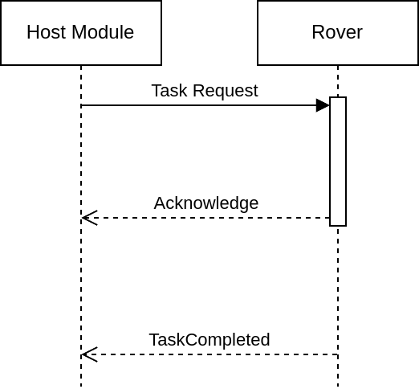
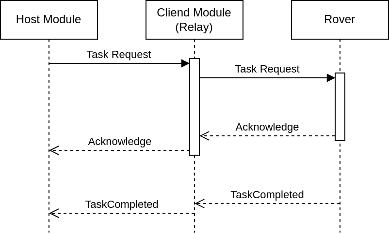

# Rover Satellite Communications Protocol
Rover Satellite Communications Protocol is a protocol for communicating with a rover over a serial connection. This project is designed for [Anatolian Rover Challenge (ARC)](www.anatolianrover.space/).

<h2>If you are a competitor in <strong>ARC'24</strong>, please watch this repository to get notified about the updates.</h2>

**Also check out [Discussions](https://github.com/anatolianroverchallenge/rscp/discussions) for updates and questions.**

# Issue Tracking
Please use the [GitHub issue tracker](https://github.com/anatolianroverchallenge/rscp/issues) to report issues or request features.
https://github.com/anatolianroverchallenge/rscp/releases

# Releases
The latest release can be found on the [GitHub releases page](https://github.com/anatolianroverchallenge/rscp/releases). If you cannot see any releases, hold tight! We are working hard.

# Table of Contents
- [Rover Satellite Communications Protocol](#rover-satellite-communications-protocol)
- [Issue Tracking](#issue-tracking)
- [Releases](#releases)
- [Table of Contents](#table-of-contents)
- [Details](#details)
  - [Frame Format](#frame-format)
    - [Frame Field Descriptions:](#frame-field-descriptions)
    - [Message Types](#message-types)
  - [Communication Sequence](#communication-sequence)
    - [Communication Sequence Diagram](#communication-sequence-diagram)
    - [Example Communication Sequences](#example-communication-sequences)
- [Getting Started (in progress)](#getting-started-in-progress)
  - [Installation of python package](#installation-of-python-package)
- [Examples (TODO)](#examples-todo)
- [License](#license)
- [Contributing](#contributing)
- [Authors](#authors)
- [Acknowledgements](#acknowledgements)

# Details

## Frame Format
| Start Byte         | Message ID Byte    | Body Length   | Body[N]             | Checksum[2]        |
| ------------------ | ------------------ | ------------- | ------------------- | ------------------ |
| `0x7E` (`uint8_t`) | MSG_ID (`uint8_t`) | N (`uint8_t`) | data (`uint8_t[N]`) | CRC16 (`uint16_t`) |

**Note**: The frame format uses big endian byte order on all fields.

### Frame Field Descriptions:
- **Start Byte**: The start byte is used to indicate the start of a frame. The start byte is a constant value of `0x7E` (`uint8_t`).
- **Message ID Byte**: The message ID byte is used to indicate the type of the message.
- **Body Length**: The body length field is used to indicate the length of the data field in bytes. 
- **Body**: The body field is used to store the data of the message. The maximum size of the body field is `255` bytes.
- **Checksum**: The checksum field is used to verify the integrity of the frame. It is calculated using the CRC-16-CCITT algorithm. The checksum is calculated over the frame starting from (incuding) start byte to last element of (including) data byte. The checksum bytes are not included in the calculation of the checksum. The checksum is stored in the checksum field in big endian byte order.

### Message Types
| Message Type  | Message ID | Body Size | Body Fields                      |
| ------------- | ---------- | --------- | -------------------------------- |
| Acknowledge   | 0x00       | 0         | None                             |
| ArmDisarm     | 0x01       | 1         | arm(bool)                        |
| NavigateToGPS | 0x02       | 8         | latitude(float),longitude(float) |
| TaskCompleted | 0x03       | 0         | None                             |
| SetStage      | 0x04       | 1         | stage(uint8_t)                   |

## Communication Sequence
There are two main components in the communication flow:
  - HM (Rover Satellite Communication - Host Module)
  - CM (Rover Satellite Communication - Client Module), used as relay between HM and Rover 
  - Rover

The communication flow is as follows:

- The **HM** sends a message to the **rover**.
- The **rover** receives the message and processes it.
- The **rover** sends an acknowledge message to the **HM**.
- The **HM** receives the acknowledge message and processes it.
- Based on the message type, the **rover** may need to send a TaskCompleted message to the **HM**.
- The **HM** receives the TaskCompleted message and processes it.

### Communication Sequence Diagram
- **HM** -> **Rover**: ArmDisarm Message
- **Rover** -> **HM**: Acknowledge Message
- **Rover** -> **HM**: TaskCompleted Message (if necessary)

`note:` All messages sent from the **HM** to the **rover** must be acknowledged by the **rover**. 

`note:` The **rover** must send a TaskCompleted message to the **HM** after completing a task, that requires some time to complete. ie. Navigating to a GPS coordinate.

`note:` All of the messages are relayed through the **CM**, which is a relay between the **HM** and the **rover**.

`note:` The **CM** uses serial communication to communicate with the **rover**.

`note:` The communication between the **CM** and the **HM** is handled by ARC committee, and is out of the scope of this project.


<p align="center">
  
</p>
<p align="center">
  <em>Communication Flow excl. the Client Module Relay</em>
</p>


<p align="center">
  
</p>
<p align="center">
  <em>Communication Flow incl. the Client Module Relay</em>
</p>

### Example Communication Sequences

**Arming/Disarming Sequence:**
  - **HM** -> **Rover**: `ArmDisarm` Message
  - **Rover** -> **HM**: `Acknowledge` Message

**Navigation Sequence:**
  - **HM** -> **Rover**: `NavigateToGPS` Message
  - **Rover** -> **HM**: `Acknowledge` Message
  - **Rover** -> **HM**: `TaskCompleted` Message

**Stage Setting Sequence:**
  - **HM** -> **Rover**: `SetStage` Message
  - **Rover** -> **HM**: `Acknowledge` Message


# Getting Started (in progress)

## Installation of python package

Build status: 

```bash
cd src/python

# make sure you have pip installed
python3 -m pip install --upgrade pip

# install required packages for building
python3 -m pip install --upgrade build pytest

# install the package in editable mode
pip install -e .

# or, build the package
python3 -m build

# or, test locally
python3 -m pytest

# or, test locally with cli logs
python3 -m pytest --log-cli-level info # or debug, warning, error ...

# or run linting
python3 -m pylint rscp
```

# Examples (TODO)

# License
This project is licensed under the terms of the [BSD 3-Clause License](LICENSE).

# Contributing
Please read [CONTRIBUTING.md](CONTRIBUTING.md) for details on our code of conduct, and the process for submitting pull requests to us.

# Authors
* **Sencer Yazici** - [Sencer Yazici](mailto:senceryazici@gmail.com)

# Acknowledgements
This project is developed for [Anatolian Rover Challenge (ARC)](https://www.anatolianrover.space/)
