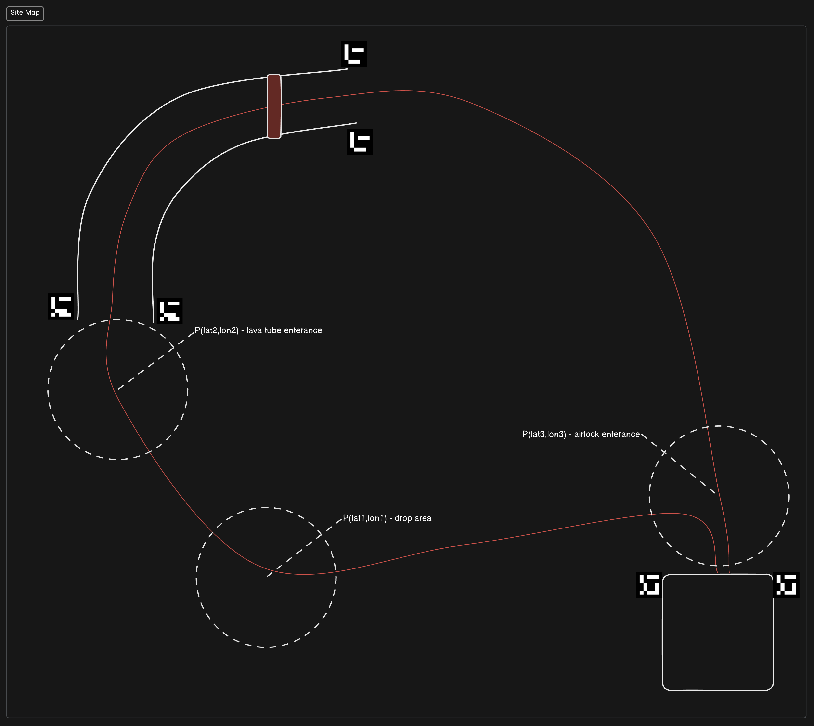

# Rover Satellite Communications Protocol
Rover Satellite Communications Protocol is a protocol for communicating with a rover over a serial connection. This project is designed for [Anatolian Rover Challenge (ARC)](www.anatolianrover.space/).

<h2>If you are a competitor in <strong>ARC'24</strong>, please watch this repository to get notified about the updates.</h2>

**Also check out [Discussions](https://github.com/anatolianroverchallenge/rscp/discussions) for updates and questions.**

# Issue Tracking
Please use the [GitHub issue tracker](https://github.com/anatolianroverchallenge/rscp/issues) to report issues or request features.
https://github.com/anatolianroverchallenge/rscp/releases

# Releases
The latest release can be found on the [GitHub releases page](https://github.com/anatolianroverchallenge/rscp/releases). If you cannot see any releases, hold tight! We are working hard.

# Table of Contents
- [Rover Satellite Communications Protocol](#rover-satellite-communications-protocol)
- [Issue Tracking](#issue-tracking)
- [Releases](#releases)
- [Table of Contents](#table-of-contents)
- [Details](#details)
  - [Frame Format](#frame-format)
  - [Communication Sequence](#communication-sequence)
  - [Example Mission Parameters](#example-mission-parameters)
- [Getting Started](#getting-started)
  - [Installation of python package](#installation-of-python-package)
  - [Examples](#examples)
- [License](#license)
- [Authors](#authors)
- [Acknowledgements](#acknowledgements)

# Details

## Frame Format
See [Frame Format](frame_format.md) for the frame format of the protocol.

## Communication Sequence
See [Communication Sequence](communication_sequence.md) for the communication sequence between the ground station and the rover.

## Example Mission Parameters
```yaml
terrain_altitude: 0.0
airlock_coordinates:
  lat: 0.0
  lon: 0.0
```

Some notes about the mission parameters:
- An `ArucoTag` is constructed by a `tag_id` and a `dictionary`. The `dictionary` of `cv2.aruco.DICT_ARUCO_ORIGINAL` will used in the competition.
- The aruco tag at the entrance of the lava tube will have the id of `269` `(i=269)`.
- The aruco tag at the exit of the lava tube will have the id of `67` `(j=67)`.
- The aruco tag at the entrance of the airlock will have the id of `297` `(k=297)`.
- the mission parameters are sent to the rover in the `SetParameters` message, at the stage 1.
- the mission parameters are stored in the rover and used during the mission execution
- the `lat, lon` values are floating point numbers in `WGS84` format, along with all GPS coordinates in the protocol.
- the `airlock_coordinates` in the mission parameters are the precise coordinates of the rover inside the airlock.
- `p1=(lat1,lon1)` will be the repeater drop area's gps coordinates
- `p2=(lat2,lon2)` will be the lava tube enterance's gps coordinates
- `p3=(lat3,lon3)` will be the airlock enterance

<p align="center">
  
</p>

# Getting Started

## Installation of python package

Build status: 

```bash
cd src/python

# make sure you have pip installed
python3 -m pip install --upgrade pip

# install required packages for building
python3 -m pip install --upgrade build pytest

# install the package in editable mode
pip install -e .

# or, build the package
python3 -m build

# or, test locally
python3 -m pytest

# or, test locally with cli logs
python3 -m pytest --log-cli-level info # or debug, warning, error ...

# or run linting
python3 -m pylint rscp
```

## Examples
[Here](examples/aruco_detection_example.py) is an example code to detect the Aruco markers which will be placed in the competition area.

**This section will receive more updates soon.**

# License
This project is licensed under the terms of the [BSD 3-Clause License](LICENSE).

# Authors
* **Sencer Yazici** - [Sencer Yazici](mailto:senceryazici@gmail.com)

# Acknowledgements
This project is developed for [Anatolian Rover Challenge (ARC)](https://www.anatolianrover.space/)
