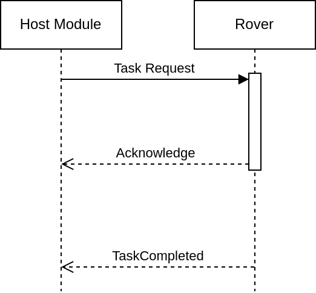
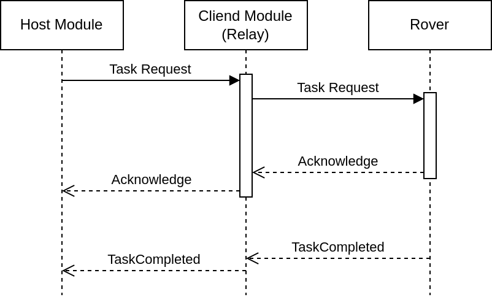

# Table of Contents
- [Table of Contents](#table-of-contents)
- [Communication Sequence](#communication-sequence)
  - [Communication Sequence Diagram](#communication-sequence-diagram)
  - [Mission Communication Sequences](#mission-communication-sequences)
    - [Stage 1](#stage-1)
    - [Stage 2](#stage-2)
    - [Stage 3](#stage-3)

# Communication Sequence
There are two main components in the communication flow:
  - HM (Rover Satellite Communication - Host Module)
  - CM (Rover Satellite Communication - Client Module), used as relay between HM and Rover 
  - Rover

The communication flow is as follows:

- The **HM** sends a message to the **rover**.
- The **rover** receives the message and processes it.
- The **rover** sends an acknowledge message to the **HM**.
- The **HM** receives the acknowledge message and processes it.
- Based on the message type, the **rover** may need to send a TaskCompleted message to the **HM**.
- The **HM** receives the TaskCompleted message and processes it.

## Communication Sequence Diagram
- **HM** -> **Rover**: ArmDisarm Message
- **Rover** -> **HM**: Acknowledge Message
- **Rover** -> **HM**: TaskCompleted Message (if necessary)

`note:` All messages sent from the **HM** to the **rover** must be acknowledged by the **rover**. 

`note:` The **rover** must send a TaskCompleted message to the **HM** after completing a task, that requires some time to complete. ie. Navigating to a GPS coordinate.

`note:` All of the messages are relayed through the **CM**, which is a relay between the **HM** and the **rover**.

`note:` The **CM** uses serial communication to communicate with the **rover**.

`note:` The communication between the **CM** and the **HM** is handled by ARC committee, and is out of the scope of this project.

  

  <em>Communication Flow excl. the Client Module Relay</em>

  

  <em>Communication Flow incl. the Client Module Relay</em>

## Mission Communication Sequences

### Stage 1
| Timing Mark | Message Type             | Direction       | Description                              | light          |
| ----------- | ------------------------ | --------------- | ---------------------------------------- | -------------- |
| --          | SetParameters(params)    | HM -> CM        | --                                       | :heart:        |
| --          | SetParameters(params)    | **CM -> Rover** | Rover receives the mission parameters    | :heart:        |
| --          | Acknowledge              | **Rover -> CM** | Rover acknowledges the parameters        | :heart:        |
| --          | Acknowledge              | CM -> HM        | --                                       | :heart:        |
| --          | SetStage(1)              | HM -> CM        | --                                       | :heart:        |
| --          | SetStage(1)              | **CM -> Rover** | Rover sets the stage to 1                | :heart:        |
| --          | Acknowledge              | **Rover -> CM** | Rover acknowledges the stage setting     | :heart:        |
| --          | Acknowledge              | CM -> HM        | --                                       | :heart:        |
| --          | ArmDisarm(arm=True)      | HM -> CM        | --                                       | :heart:        |
| --          | ArmDisarm(arm=True)      | **CM -> Rover** | Rover arms itself                        | :green_heart:  |
| --          | Acknowledge              | **Rover -> CM** | Rover acknowledges the arming request    | :green_heart:  |
| --          | Acknowledge              | CM -> HM        | --                                       | :green_heart:  |
| --          | NavigateToGPS(lat1,lon1) | HM -> CM        | --                                       | :green_heart:  |
| --          | NavigateToGPS(lat1,lon1) | **CM -> Rover** | Rover starts receives GPS coordinates    | :green_heart:  |
| --          | Acknowledge              | **Rover -> CM** | Rover acknowledges and starts navigation | :yellow_heart: |
| t0          | Acknowledge              | CM -> HM        | --                                       | :yellow_heart: |
| --          | no message sent          | --              | finished navigating                      | :yellow_heart: |
| --          | no message sent          | --              | drop repeater                            | :yellow_heart: |
| --          | TaskCompleted            | **Rover -> CM** | rover reports navigation finished        | :green_heart:  |
| t1          | TaskCompleted            | CM -> HM        | Navigation duration = t1(now) - t0       | :green_heart:  |

Here is the visual representation of the stage 1 sequence:

  

### Stage 2
| Timing Mark | Message Type             | Direction       | Description                                    | light          |
| ----------- | ------------------------ | --------------- | ---------------------------------------------- | -------------- |
| --          | SetStage(2)              | HM -> CM        | --                                             | :green_heart:  |
| --          | SetStage(2)              | **CM -> Rover** | Rover sets the stage to 2                      | :green_heart:  |
| --          | Acknowledge              | **Rover -> CM** | Rover acknowledges the stage setting           | :green_heart:  |
| --          | Acknowledge              | CM -> HM        | --                                             | :green_heart:  |
| --          | NavigateToGPS(lat2,lon2) | HM -> CM        | --                                             | :green_heart:  |
| --          | NavigateToGPS(lat2,lon2) | **CM -> Rover** | Rover starts receives GPS coordinates          | :green_heart:  |
| --          | Acknowledge              | **Rover -> CM** | Rover acknowledges and starts navigation       | :green_heart:  |
| t2          | Acknowledge              | CM -> HM        | --                                             | :yellow_heart: |
| --          | no message sent          | --              | finished navigating                            | :yellow_heart: |
| --          | TaskCompleted            | **Rover -> CM** | rover reports navigation finished              | :green_heart:  |
| t3          | TaskCompleted            | CM -> HM        | Navigation duration = t3(now) - t2             | :green_heart:  |
| --          | LocateArucoTags(...)     | HM -> CM        | --                                             | :green_heart:  |
| --          | LocateArucoTags(...)     | **CM -> Rover** | Rover receives search & locate request         | :green_heart:  |
| --          | Acknowledge              | **Rover -> CM** | Rover acknowledges and starts locating         | :yellow_heart: |
| t4          | Acknowledge              | CM -> HM        | --                                             | :yellow_heart: |
| --          | no message sent          | --              | Rover locates tag i (lava tube enterance)      | :yellow_heart: |
| --          | no message sent          | --              | continue exploring                             | :yellow_heart: |
| --          | Detection(3.10, "red")   | **Rover -> CM** | Rover detects colored cardboard                | :yellow_heart: |
| --          | Detection(3.10, "red")   | CM -> HM        | points earned if repeater positioned           | :yellow_heart: |
| --          | no message sent          | --              | continue exploring                             | :yellow_heart: |
| --          | no message sent          | --              | Rover locates tag j (lava tube exit) and exits | :yellow_heart: |
| --          | Detection(3.10, "red")   | **Rover -> CM** | Rover reports detected colored cardboard       | :yellow_heart: |
| --          | Detection(3.10, "red")   | CM -> HM        | points earned if rover exits the tunnel        | :yellow_heart: |
| --          | TaskCompleted            | **Rover -> CM** | rover reports mission completed                | :green_heart:  |
| t5          | TaskCompleted            | CM -> HM        | task duration = t5(now) - t4                   | :green_heart:  |

*LocateArucoTags(...) = LocateArucoTags([ArucoTag(i, 16), ArucoTag(j, 16)])*

  

### Stage 3
| Timing Mark | Message Type                       | Direction       | Description                                    | light          |
| ----------- | ---------------------------------- | --------------- | ---------------------------------------------- | -------------- |
| --          | SetStage(3)                        | HM -> CM        | --                                             | :green_heart:  |
| --          | SetStage(3)                        | **CM -> Rover** | Rover sets the stage to 3                      | :green_heart:  |
| --          | Acknowledge                        | **Rover -> CM** | Rover acknowledges the stage setting           | :green_heart:  |
| --          | Acknowledge                        | CM -> HM        | --                                             | :green_heart:  |
| --          | NavigateToGPS(lat3,lon3)           | HM -> CM        | --                                             | :green_heart:  |
| --          | NavigateToGPS(lat3,lon3)           | **CM -> Rover** | Rover starts receives GPS coordinates          | :green_heart:  |
| --          | Acknowledge                        | **Rover -> CM** | Rover acknowledges and starts navigation       | :yellow_heart: |
| t6          | Acknowledge                        | CM -> HM        | --                                             | :yellow_heart: |
| --          | no message sent                    | --              | finished navigating                            | :yellow_heart: |
| --          | TaskCompleted                      | **Rover -> CM** | rover reports navigation finished              | :green_heart:  |
| t7          | TaskCompleted                      | CM -> HM        | Navigation duration = t7(now) - t6             | :green_heart:  |
| --          | LocateArucoTags([ArucoTag(k, 16)]) | HM -> CM        | --                                             | :green_heart:  |
| --          | LocateArucoTags([ArucoTag(k, 16)]) | **CM -> Rover** | Rover receives search & locate request         | :green_heart:  |
| --          | Acknowledge                        | **Rover -> CM** | Rover acknowledges and starts locating         | :yellow_heart: |
| t8          | Acknowledge                        | CM -> HM        | --                                             | :yellow_heart: |
| --          | no message sent                    | --              | Rover locates tag k (airlock enterance)        | :yellow_heart: |
| --          | no message sent                    | --              | Rover docks to the airlock                     | :yellow_heart: |
| --          | TaskCompleted                      | **Rover -> CM** | rover reports mission completed                | :green_heart:  |
| t9          | TaskCompleted                      | CM -> HM        | task duration = t9(now) - t8                   | :green_heart:  |
| --          | ArmDisarm(arm=False)               | HM -> CM        | --                                             | :green_heart:  |
| --          | ArmDisarm(arm=False)               | **CM -> Rover** | Rover disarms itself, light turns green to red | :heart:        |
| --          | Acknowledge                        | **Rover -> CM** | Rover acknowledges the arming request          | :heart:        |
| --          | Acknowledge                        | CM -> HM        | mission completed.                             | :heart:        |

  

