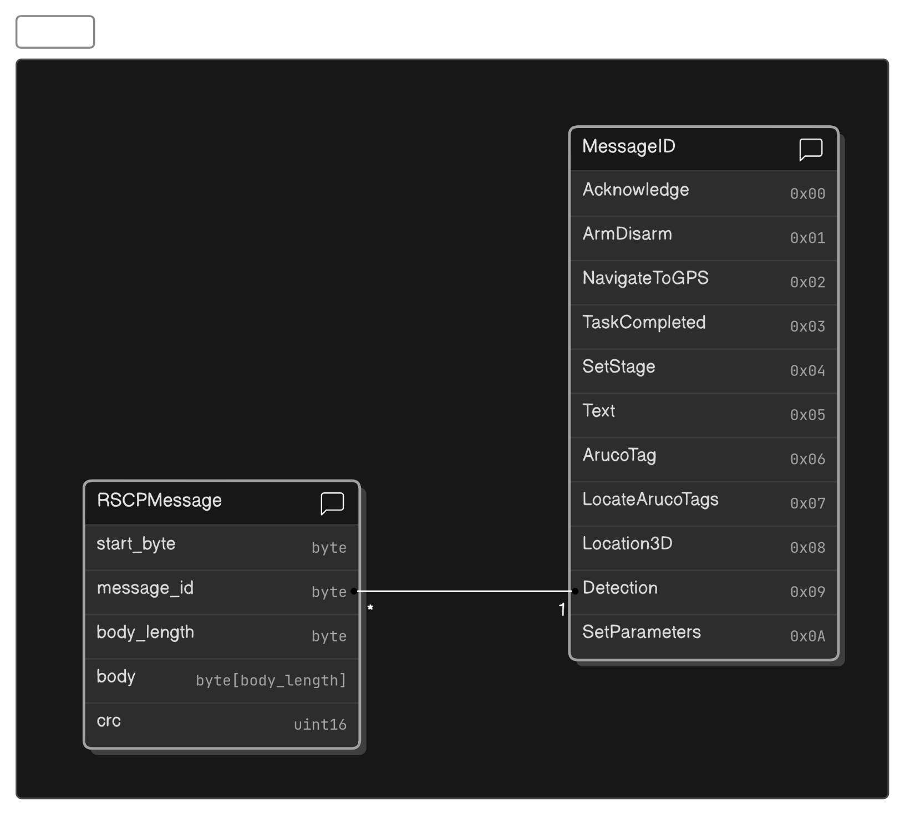
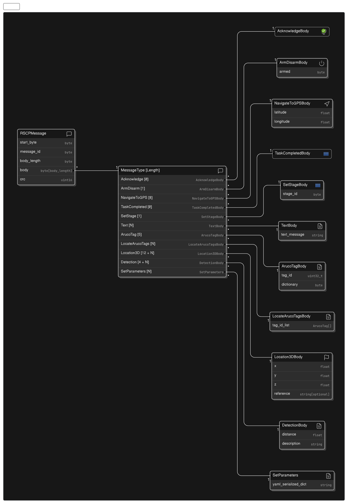

# Table of Contents
- [Table of Contents](#table-of-contents)
- [Frame Format](#frame-format)
  - [Frame Field Descriptions:](#frame-field-descriptions)
  - [Message Types](#message-types)

# Frame Format
| Start Byte         | Message ID Byte    | Body Length   | Body[N]             | Checksum[2]        |
| ------------------ | ------------------ | ------------- | ------------------- | ------------------ |
| `0x7E` (`uint8_t`) | MSG_ID (`uint8_t`) | N (`uint8_t`) | data (`uint8_t[N]`) | CRC16 (`uint16_t`) |

**Note**: The frame format uses big endian byte order on all fields.

## Frame Field Descriptions:
- **Start Byte**: The start byte is used to indicate the start of a frame. The start byte is a constant value of `0x7E` (`uint8_t`).
- **Message ID Byte**: The message ID byte is used to indicate the type of the message.
- **Body Length**: The body length field is used to indicate the length of the data field in bytes. 
- **Body**: The body field is used to store the data of the message. The maximum size of the body field is `255` bytes.
- **Checksum**: The checksum field is used to verify the integrity of the frame. It is calculated using the CRC-16-CCITT algorithm. The checksum is calculated over the frame starting from (incuding) start byte to last element of (including) data byte. The checksum bytes are not included in the calculation of the checksum. The checksum is stored in the checksum field in big endian byte order.

## Message Types
| Message Type    | Message ID | Body Size | Body Fields                                             |
| --------------- | ---------- | --------- | ------------------------------------------------------- |
| Acknowledge     | 0x00       | 0         | None                                                    |
| ArmDisarm       | 0x01       | 1         | arm(bool)                                               |
| NavigateToGPS   | 0x02       | 8         | latitude(float),longitude(float)                        |
| TaskCompleted   | 0x03       | 0         | None                                                    |
| SetStage        | 0x04       | 1         | stage(uint8_t)                                          |
| Text            | 0x05       | N         | text(char[N])                                           |
| ArucoTag        | 0x06       | 5         | tag_id(uint32_t),dictionary(uint8_t)                    |
| LocateArucoTags | 0x07       | N         | tag_list(ArucoTag[N / 5])                               |
| Location3D      | 0x08       | 12 + N    | x(float),y(float),z(float),reference<optional>(char[N]) |
| Detection       | 0x09       | 4 + N     | distance(float),color(char[N])                          |
| SetParameters   | 0x0A       | N         | parameter_dict_in_yaml(char[N])                         |

Here is the visual representation of the message types:

  

  

